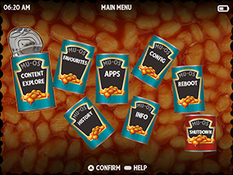

# muOS Theme Repository

Here you can download all the themes, made by members of the muOS community. 
- [Official muOS website](https://muos.dev/).
- Join the community [here](https://discord.gg/USS5ybVtDz).
- Check out the [Releases](https://github.com/MustardOS/theme/releases) page to download every theme as an archive.

Drop any of these .zip files into your device's ARCHIVE folder, using the on-device Archive Manager application to install them.

|   |   |   |
| :-----------------------------------------------------------: | :-----------------------------------------------------------: | :-----------------------------------------------------------: |
|  [Analogue-Arimo](https://github.com/MustardOS/theme/releases/download/2024-05-31_1018/Analogue-Arimo.zip)  by: Cheema OTB |  [Analogue](https://github.com/MustardOS/theme/releases/download/2024-05-31_1018/Analogue.zip)  by: VagueParade  |  [Art Book Next v1](https://github.com/MustardOS/theme/releases/download/2024-05-31_1018/Art.Book.Next.v1.zip)  by: VagueParade  |  [Art Book Next v2](https://github.com/MustardOS/theme/releases/download/2024-05-31_1018/Art.Book.Next.v2.zip)  by: VagueParade |  [Beanz](https://github.com/MustardOS/theme/releases/download/2024-05-31_1018/Beanz.zip)  by: VagueParade  |  [Blade](https://github.com/MustardOS/theme/releases/download/2024-05-31_1018/Blade.zip)  by: VagueParade  |
|  [Analogue-Arimo](https://github.com/MustardOS/theme/releases/download/2024-05-31_1018/Analogue-Arimo.zip)  by: VagueParade |  [Analogue-Arimo](https://github.com/MustardOS/theme/releases/download/2024-05-31_1018/Analogue-Arimo.zip)  by: VagueParade  |  [Analogue-Arimo](https://github.com/MustardOS/theme/releases/download/2024-05-31_1018/Analogue-Arimo.zip)  by: VagueParade  |
|  [Analogue-Arimo](https://github.com/MustardOS/theme/releases/download/2024-05-31_1018/Analogue-Arimo.zip)  by: VagueParade |  [Analogue-Arimo](https://github.com/MustardOS/theme/releases/download/2024-05-31_1018/Analogue-Arimo.zip)  by: VagueParade  |  [Analogue-Arimo](https://github.com/MustardOS/theme/releases/download/2024-05-31_1018/Analogue-Arimo.zip)  by: VagueParade  |
|  [Analogue-Arimo](https://github.com/MustardOS/theme/releases/download/2024-05-31_1018/Analogue-Arimo.zip)  by: VagueParade |  [Analogue-Arimo](https://github.com/MustardOS/theme/releases/download/2024-05-31_1018/Analogue-Arimo.zip)  by: VagueParade  |  [Analogue-Arimo](https://github.com/MustardOS/theme/releases/download/2024-05-31_1018/Analogue-Arimo.zip)  by: VagueParade  |
|  [Analogue-Arimo](https://github.com/MustardOS/theme/releases/download/2024-05-31_1018/Analogue-Arimo.zip)  by: VagueParade |  [Analogue-Arimo](https://github.com/MustardOS/theme/releases/download/2024-05-31_1018/Analogue-Arimo.zip)  by: VagueParade  |  [Analogue-Arimo](https://github.com/MustardOS/theme/releases/download/2024-05-31_1018/Analogue-Arimo.zip)  by: VagueParade  |
|  [Analogue-Arimo](https://github.com/MustardOS/theme/releases/download/2024-05-31_1018/Analogue-Arimo.zip)  by: VagueParade |  [Analogue-Arimo](https://github.com/MustardOS/theme/releases/download/2024-05-31_1018/Analogue-Arimo.zip)  by: VagueParade  |  [Analogue-Arimo](https://github.com/MustardOS/theme/releases/download/2024-05-31_1018/Analogue-Arimo.zip)  by: VagueParade  |
|  [Analogue-Arimo](https://github.com/MustardOS/theme/releases/download/2024-05-31_1018/Analogue-Arimo.zip)  by: VagueParade |  [Analogue-Arimo](https://github.com/MustardOS/theme/releases/download/2024-05-31_1018/Analogue-Arimo.zip)  by: VagueParade  |  [Analogue-Arimo](https://github.com/MustardOS/theme/releases/download/2024-05-31_1018/Analogue-Arimo.zip)  by: VagueParade  |
|  [Analogue-Arimo](https://github.com/MustardOS/theme/releases/download/2024-05-31_1018/Analogue-Arimo.zip)  by: VagueParade |  [Analogue-Arimo](https://github.com/MustardOS/theme/releases/download/2024-05-31_1018/Analogue-Arimo.zip)  by: VagueParade  |  [Analogue-Arimo](https://github.com/MustardOS/theme/releases/download/2024-05-31_1018/Analogue-Arimo.zip)  by: VagueParade  |
|  [Analogue-Arimo](https://github.com/MustardOS/theme/releases/download/2024-05-31_1018/Analogue-Arimo.zip)  by: VagueParade |  [Analogue-Arimo](https://github.com/MustardOS/theme/releases/download/2024-05-31_1018/Analogue-Arimo.zip)  by: VagueParade  |  [Analogue-Arimo](https://github.com/MustardOS/theme/releases/download/2024-05-31_1018/Analogue-Arimo.zip)  by: VagueParade  |
|  [Analogue-Arimo](https://github.com/MustardOS/theme/releases/download/2024-05-31_1018/Analogue-Arimo.zip)  by: VagueParade |  [Analogue-Arimo](https://github.com/MustardOS/theme/releases/download/2024-05-31_1018/Analogue-Arimo.zip)  by: VagueParade  |  [Analogue-Arimo](https://github.com/MustardOS/theme/releases/download/2024-05-31_1018/Analogue-Arimo.zip)  by: VagueParade  |
|  [Analogue-Arimo](https://github.com/MustardOS/theme/releases/download/2024-05-31_1018/Analogue-Arimo.zip)  by: VagueParade |  [Analogue-Arimo](https://github.com/MustardOS/theme/releases/download/2024-05-31_1018/Analogue-Arimo.zip)  by: VagueParade  |  [Analogue-Arimo](https://github.com/MustardOS/theme/releases/download/2024-05-31_1018/Analogue-Arimo.zip)  by: VagueParade  |
|  [Analogue-Arimo](https://github.com/MustardOS/theme/releases/download/2024-05-31_1018/Analogue-Arimo.zip)  by: VagueParade |  [Analogue-Arimo](https://github.com/MustardOS/theme/releases/download/2024-05-31_1018/Analogue-Arimo.zip)  by: VagueParade  |  [Analogue-Arimo](https://github.com/MustardOS/theme/releases/download/2024-05-31_1018/Analogue-Arimo.zip)  by: VagueParade  |
|  [Analogue-Arimo](https://github.com/MustardOS/theme/releases/download/2024-05-31_1018/Analogue-Arimo.zip)  by: VagueParade |  [Analogue-Arimo](https://github.com/MustardOS/theme/releases/download/2024-05-31_1018/Analogue-Arimo.zip)  by: VagueParade  |  [Analogue-Arimo](https://github.com/MustardOS/theme/releases/download/2024-05-31_1018/Analogue-Arimo.zip)  by: VagueParade  |
|  [Analogue-Arimo](https://github.com/MustardOS/theme/releases/download/2024-05-31_1018/Analogue-Arimo.zip)  by: VagueParade |  [Analogue-Arimo](https://github.com/MustardOS/theme/releases/download/2024-05-31_1018/Analogue-Arimo.zip)  by: VagueParade  |  [Analogue-Arimo](https://github.com/MustardOS/theme/releases/download/2024-05-31_1018/Analogue-Arimo.zip)  by: VagueParade  |
|  [Analogue-Arimo](https://github.com/MustardOS/theme/releases/download/2024-05-31_1018/Analogue-Arimo.zip)  by: VagueParade |  [Analogue-Arimo](https://github.com/MustardOS/theme/releases/download/2024-05-31_1018/Analogue-Arimo.zip)  by: VagueParade  |  [Analogue-Arimo](https://github.com/MustardOS/theme/releases/download/2024-05-31_1018/Analogue-Arimo.zip)  by: VagueParade  |
|  [Analogue-Arimo](https://github.com/MustardOS/theme/releases/download/2024-05-31_1018/Analogue-Arimo.zip)  by: VagueParade |  [Analogue-Arimo](https://github.com/MustardOS/theme/releases/download/2024-05-31_1018/Analogue-Arimo.zip)  by: VagueParade  |  [Analogue-Arimo](https://github.com/MustardOS/theme/releases/download/2024-05-31_1018/Analogue-Arimo.zip)  by: VagueParade  |
|  [Analogue-Arimo](https://github.com/MustardOS/theme/releases/download/2024-05-31_1018/Analogue-Arimo.zip)  by: VagueParade |  [Analogue-Arimo](https://github.com/MustardOS/theme/releases/download/2024-05-31_1018/Analogue-Arimo.zip)  by: VagueParade  |  [Analogue-Arimo](https://github.com/MustardOS/theme/releases/download/2024-05-31_1018/Analogue-Arimo.zip)  by: VagueParade  |
|  [Analogue-Arimo](https://github.com/MustardOS/theme/releases/download/2024-05-31_1018/Analogue-Arimo.zip)  by: VagueParade |  [Analogue-Arimo](https://github.com/MustardOS/theme/releases/download/2024-05-31_1018/Analogue-Arimo.zip)  by: VagueParade  |  [Analogue-Arimo](https://github.com/MustardOS/theme/releases/download/2024-05-31_1018/Analogue-Arimo.zip)  by: VagueParade  |
|  [Analogue-Arimo](https://github.com/MustardOS/theme/releases/download/2024-05-31_1018/Analogue-Arimo.zip)  by: VagueParade |  [Analogue-Arimo](https://github.com/MustardOS/theme/releases/download/2024-05-31_1018/Analogue-Arimo.zip)  by: VagueParade  |  [Analogue-Arimo](https://github.com/MustardOS/theme/releases/download/2024-05-31_1018/Analogue-Arimo.zip)  by: VagueParade  |
|  [Analogue-Arimo](https://github.com/MustardOS/theme/releases/download/2024-05-31_1018/Analogue-Arimo.zip)  by: VagueParade |  [Analogue-Arimo](https://github.com/MustardOS/theme/releases/download/2024-05-31_1018/Analogue-Arimo.zip)  by: VagueParade  |  [Analogue-Arimo](https://github.com/MustardOS/theme/releases/download/2024-05-31_1018/Analogue-Arimo.zip)  by: VagueParade  |
