# muOS Theme Repository

Here you can download all the themes, made by members of the muOS community. 
- [Official muOS website](https://muos.dev/).
- Join the community [here](https://discord.gg/USS5ybVtDz).
- Check out the [Releases](https://github.com/MustardOS/theme/releases) page to download every theme as an archive.

Drop any of these .zip files into your device's ARCHIVE folder, using the on-device Archive Manager application to install them.

|   |   |   |
| :-----------------------------------------------------------: | :-----------------------------------------------------------: | :-----------------------------------------------------------: |
|   [Analogue-Arimo](https://github.com/MustardOS/theme/releases/download/2024-05-31_1018/Analogue-Arimo.zip)  by: Cheema OTB (original: Aemiii91) |   [Analogue](https://github.com/MustardOS/theme/releases/download/2024-05-31_1018/Analogue.zip)  by: Cheema OTB (original: Aemiii91)  |   [Art Book Next v1](https://github.com/MustardOS/theme/releases/download/2024-05-31_1018/Art.Book.Next.v1.zip)  by: ciskao (original: alphatoanant)  |   [Art Book Next v2](https://github.com/MustardOS/theme/releases/download/2024-05-31_1018/Art.Book.Next.v2.zip)  by: ciskao (original: alphatoanant) |   [Beanz](https://github.com/MustardOS/theme/releases/download/2024-05-31_1018/Beanz.zip)  by: VagueParade  |   [Blade](https://github.com/MustardOS/theme/releases/download/2024-05-31_1018/Blade.zip)  by: LMarcoMiranda  |
| 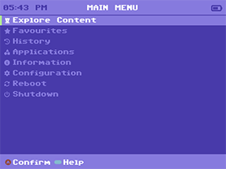  [C64](https://github.com/MustardOS/theme/releases/download/2024-05-31_1018/C64.zip)  by: antiKK | 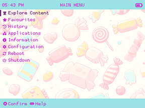  [Candy](https://github.com/MustardOS/theme/releases/download/2024-05-31_1018/Candy.zip)  by: antiKK  |   [Catppuccin Frappe](https://github.com/MustardOS/theme/releases/download/2024-05-31_1018/Catppuccin.Frappe.zip)  by: jupyter & antiKK (original: Catppuccin)  |
| 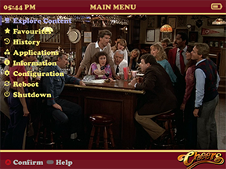  [Cheers](https://github.com/MustardOS/theme/releases/download/2024-05-31_1018/Cheers.zip)  by: WhatPriceLJN | 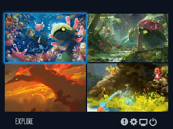  [Custom2](https://github.com/MustardOS/theme/releases/download/2024-05-31_1018/Custom2.zip)  by: Vaidotas  |   [Cyberpunk Neon](https://github.com/MustardOS/theme/releases/download/2024-05-31_1018/Cyberpunk.Neon.zip)  by: antiKK  |
| 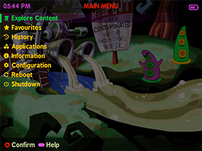  [DOTT](https://github.com/MustardOS/theme/releases/download/2024-05-31_1018/DOTT.zip)  by: antiKK |   [Def not SFC - Dark](https://github.com/MustardOS/theme/releases/download/2024-05-31_1018/Def.not.SFC.-.Dark.zip)  by: Skilo (original: danilocolasso)  |   [Def not SNES](https://github.com/MustardOS/theme/releases/download/2024-05-31_1018/Def.not.SNES.zip)  by: Skilo (original: danilocolasso)  |
|   [Disk Sys](https://github.com/MustardOS/theme/releases/download/2024-05-31_1018/Disk.Sys.zip)  by: Mr.DomoDude | 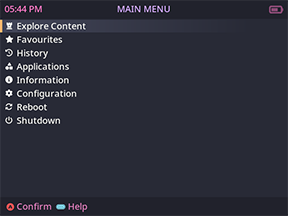  [Dracula](https://github.com/MustardOS/theme/releases/download/2024-05-31_1018/Dracula.zip)  by: antiKK  |   [Dreamcast Themecast](https://github.com/MustardOS/theme/releases/download/2024-05-31_1018/Dreamcast.Themecast.zip)  by: VagueParade  |
|   [dsOS](https://github.com/MustardOS/theme/releases/download/2024-05-31_1018/dsOS.zip)  by: DukeSilver | 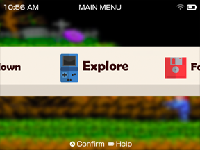  [EmulationStation](https://github.com/MustardOS/theme/releases/download/2024-05-31_1018/EmulationStation.zip)  by: jellydude72 |   [Fallout Caution](https://github.com/MustardOS/theme/releases/download/2024-05-31_1018/Fallout.Caution.zip)  by: antiKK  |   [Faux Dark](https://github.com/MustardOS/theme/releases/download/2024-05-31_1018/Faux.Dark.zip)  by: antiKK  |
|   [GB Dark](https://github.com/MustardOS/theme/releases/download/2024-05-31_1018/GB.Dark.zip)  by: Alukim |        [GB Light](https://github.com/MustardOS/theme/releases/download/2024-05-31_1018/GB.Light.zip)  by: Alukim  |   [GamePal - LCDLight](https://github.com/MustardOS/theme/releases/download/2024-05-31_1018/GamePal.-.LCDLight.zip)  by: vacarotti  |
|   [GamePal - LCDNight](https://github.com/MustardOS/theme/releases/download/2024-05-31_1018/GamePal.-.LCDNight.zip)  by: vacarotti |   [GamePal - Light](https://github.com/MustardOS/theme/releases/download/2024-05-31_1018/GamePal.-.Light.zip)  by: vacarotti  |   [GamePal - Night](https://github.com/MustardOS/theme/releases/download/2024-05-31_1018/GamePal.-.Night.zip)  by: vacarotti  |
|   [GamePal - SnesLight](https://github.com/MustardOS/theme/releases/download/2024-05-31_1018/GamePal.-.SnesLight.zip)  by: vacarotti |   [GamePal - SnesNight](https://github.com/MustardOS/theme/releases/download/2024-05-31_1018/GamePal.-.SnesNight.zip)  by: vacarotti  |   [GamePal - Sober](https://github.com/MustardOS/theme/releases/download/2024-05-31_1018/GamePal.-.Sober.zip)  by: vacarotti  |
| 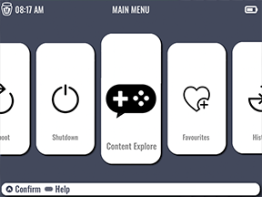  [GarstardOS](https://github.com/MustardOS/theme/releases/download/2024-05-31_1018/GarstardOS.zip)  by: VagueParade |   [GbOS Color - Amber](https://github.com/MustardOS/theme/releases/download/2024-05-31_1018/GbOS.Color.-.Amber.zip)  by: ciskao  |   [GbOS Color - Black](https://github.com/MustardOS/theme/releases/download/2024-05-31_1018/GbOS.Color.-.Black.zip)  by: ciskao  |
|   [GbOS Color - DMG](https://github.com/MustardOS/theme/releases/download/2024-05-31_1018/GbOS.Color.-.DMG.zip)  by: ciskao  |   [GbOS Color - Diamond](https://github.com/MustardOS/theme/releases/download/2024-05-31_1018/GbOS.Color.-.Diamond.zip)  by: ciskao  |   [GbOS Color - Obsidian](https://github.com/MustardOS/theme/releases/download/2024-05-31_1018/GbOS.Color.-.Obsidian.zip)  by: ciskao  |
|   [GbOS Color - Ruby](https://github.com/MustardOS/theme/releases/download/2024-05-31_1018/GbOS.Color.-.Ruby.zip)  by: ciskao  |   [GbOS Color - Sapphire](https://github.com/MustardOS/theme/releases/download/2024-05-31_1018/GbOS.Color.-.Sapphire.zip)  by: ciskao  |   [GbOS Color - White](https://github.com/MustardOS/theme/releases/download/2024-05-31_1018/GbOS.Color.-.White.zip)  by: ciskao  |
|   [GbOS Minimal](https://github.com/MustardOS/theme/releases/download/2024-05-31_1018/GbOS.Minimal.zip)  by: ciskao  |   [GbOS](https://github.com/MustardOS/theme/releases/download/2024-05-31_1018/GbOS.zip)  by: ciskao  |   [Genki Denki GOGOGO](https://github.com/MustardOS/theme/releases/download/2024-05-31_1018/Genki.Denki.GOGOGO.zip)  by: Cerceis  |
|   [GenshinImpact](https://github.com/MustardOS/theme/releases/download/2024-05-31_1018/GenshinImpact.zip)  by: Lê Sang Húc |   [Glass V1](https://github.com/MustardOS/theme/releases/download/2024-05-31_1018/Glass.V1.zip)  by: r4in  |   [Gruvbox Dark](https://github.com/MustardOS/theme/releases/download/2024-05-31_1018/Gruvbox.Dark.zip)  by: spitchell  |
|   [Gruvbox Light](https://github.com/MustardOS/theme/releases/download/2024-05-31_1018/Gruvbox.Light.zip)  by: spitchell |   [Haze Dark](https://github.com/MustardOS/theme/releases/download/2024-05-31_1018/Haze.Dark.zip)  by: LMarcoMiranda  | 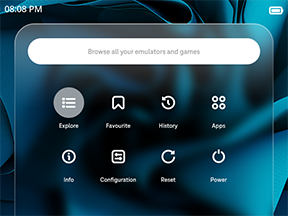  [Haze](https://github.com/MustardOS/theme/releases/download/2024-05-31_1018/Haze.zip)  by: LMarcoMiranda  |
|   [Hello Kitty](https://github.com/MustardOS/theme/releases/download/2024-05-31_1018/Hello.Kitty.zip)  by: VagueParade |   [High Contrast](https://github.com/MustardOS/theme/releases/download/2024-05-31_1018/High.Contrast.zip)  by: RazamaBazakart  | 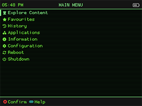  [Kernel](https://github.com/MustardOS/theme/releases/download/2024-05-31_1018/Kernel.zip)  by: slayturade  |
|   [LCD H](https://github.com/MustardOS/theme/releases/download/2024-05-31_1018/LCD.H.zip)  by: antiKK |   [LCD Plus](https://github.com/MustardOS/theme/releases/download/2024-05-31_1018/LCD.Plus.zip)  by: antiKK  |   [Lyxodius Dark Black](https://github.com/MustardOS/theme/releases/download/2024-05-31_1018/Lyxodius.Dark.Black.zip)  by: Lyxodius  |
|   [Lyxodius Dark Blue](https://github.com/MustardOS/theme/releases/download/2024-05-31_1018/Lyxodius.Dark.Blue.zip)  by: Lyxodius |   [Lyxodius Dark Grey](https://github.com/MustardOS/theme/releases/download/2024-05-31_1018/Lyxodius.Dark.Grey.zip)  by: Lyxodius  |   [mu-rder-OS](https://github.com/MustardOS/theme/releases/download/2024-05-31_1018/mu-rder-OS.zip)  by: antiKK |
|   [muDS](https://github.com/MustardOS/theme/releases/download/2024-05-31_1018/muDS.zip)  by: VagueParade |   [muLCARS](https://github.com/MustardOS/theme/releases/download/2024-05-31_1018/muLCARS.zip)  by: Danrar |   [muOS - Beans](https://github.com/MustardOS/theme/releases/download/2024-05-31_1018/muOS.-.Beans.zip)  by: LMarcoMiranda |
|   [muOS - Classic](https://github.com/MustardOS/theme/releases/download/2024-05-31_1018/muOS.-.Classic.zip)  by: xonglebongle |   [muOS - Concise](https://github.com/MustardOS/theme/releases/download/2024-05-31_1018/muOS.-.Concise.zip)  by: sadchocobo (original: mtaras) |   [muOS - Horizontal](https://github.com/MustardOS/theme/releases/download/2024-05-31_1018/muOS.-.Horizontal.zip)  by: xonglebongle & VagueParade |
|   [muOS - NeXT](https://github.com/MustardOS/theme/releases/download/2024-05-31_1018/muOS.-.NeXT.zip)  by: jdcross |   [muOS - Pixels](https://github.com/MustardOS/theme/releases/download/2024-05-31_1018/muOS.-.Pixels.zip)  by: Game Over Jay |  [MustardFighter](https://github.com/MustardOS/theme/releases/download/2024-05-31_1018/MustardFighter.zip)  by: LaughingMan  |
|   [muVB](https://github.com/MustardOS/theme/releases/download/2024-05-31_1018/muVB.zip)  by: RazamaBazakart |
|   [muXP](https://github.com/MustardOS/theme/releases/download/2024-05-31_1018/muXP.zip)  by: DukeSilver |   [muXbox Dark](https://github.com/MustardOS/theme/releases/download/2024-05-31_1018/muXbox.Dark.zip)  by: VagueParade |   [muXbox](https://github.com/MustardOS/theme/releases/download/2024-05-31_1018/muXbox.zip)  by: VagueParade |
|   [mubiOS](https://github.com/MustardOS/theme/releases/download/2024-05-31_1018/mubiOS.zip)  by: RazamaBazakart |  [New Classic](https://github.com/MustardOS/theme/releases/download/2024-05-31_1018/New.Classic.zip)  by: lezzob (original: vacarotti) |   [Nita](https://github.com/MustardOS/theme/releases/download/2024-05-31_1018/Nita.zip)  by: jdcross  | 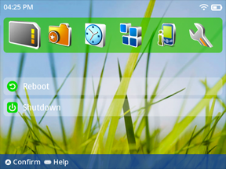  [Nokia](https://github.com/MustardOS/theme/releases/download/2024-05-31_1018/Nokia.zip)  by: Lê Sang Húc  |
|   [nxOS](https://github.com/MustardOS/theme/releases/download/2024-05-31_1018/nxOS.zip)  by: ciskao | 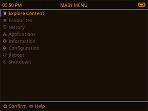  [Orange](https://github.com/MustardOS/theme/releases/download/2024-05-31_1018/Orange.zip)  by: antiKK |   [POP - Battle Network Blue](https://github.com/MustardOS/theme/releases/download/2024-05-31_1018/POP.-.Battle.Network.Blue.zip)  by: LMarcoMiranda  |   [POP - Gandalf Grey](https://github.com/MustardOS/theme/releases/download/2024-05-31_1018/POP.-.Gandalf.Grey.zip)  by: LMarcoMiranda  |
|   [POP - Orange Cream](https://github.com/MustardOS/theme/releases/download/2024-05-31_1018/POP.-.Orange.Cream.zip)  by: LMarcoMiranda |   [POP - Particularly Pink](https://github.com/MustardOS/theme/releases/download/2024-05-31_1018/POP.-.Particularly.Pink.zip)  by: LMarcoMiranda  |   [POP - Taro Purple](https://github.com/MustardOS/theme/releases/download/2024-05-31_1018/POP.-.Taro.Purple.zip)  by: LMarcoMiranda  |
|   [PS Aqua](https://github.com/MustardOS/theme/releases/download/2024-05-31_1018/PS.Aqua.zip)  by: VagueParade |   [PS Black](https://github.com/MustardOS/theme/releases/download/2024-05-31_1018/PS.Black.zip)  by: VagueParade |   [PS Blue](https://github.com/MustardOS/theme/releases/download/2024-05-31_1018/PS.Blue.zip)  by: VagueParade |
|   [PS Bronze](https://github.com/MustardOS/theme/releases/download/2024-05-31_1018/PS.Bronze.zip)  by: VagueParade |   [PS Candy](https://github.com/MustardOS/theme/releases/download/2024-05-31_1018/PS.Candy.zip)  by: VagueParade |   [PS Gold](https://github.com/MustardOS/theme/releases/download/2024-05-31_1018/PS.Gold.zip)  by: VagueParade |
|   [PS Green](https://github.com/MustardOS/theme/releases/download/2024-05-31_1018/PS.Green.zip)  by: VagueParade |   [PS Grey](https://github.com/MustardOS/theme/releases/download/2024-05-31_1018/PS.Grey.zip)  by: VagueParade |   [PS Orange](https://github.com/MustardOS/theme/releases/download/2024-05-31_1018/PS.Orange.zip)  by: VagueParade |
|   [PS Purple](https://github.com/MustardOS/theme/releases/download/2024-05-31_1018/PS.Purple.zip)  by: VagueParade |   [PS Red](https://github.com/MustardOS/theme/releases/download/2024-05-31_1018/PS.Red.zip)  by: VagueParade |   [PS Silver](https://github.com/MustardOS/theme/releases/download/2024-05-31_1018/PS.Silver.zip)  by: VagueParade |
|   [PS Violet](https://github.com/MustardOS/theme/releases/download/2024-05-31_1018/PS.Violet.zip)  by: VagueParade |   [Plexus](https://github.com/MustardOS/theme/releases/download/2024-05-31_1018/Plexus.zip)  by: LMarcoMiranda |   [Purple Night](https://github.com/MustardOS/theme/releases/download/2024-05-31_1018/Purple.Night.zip)  by: slayturade |
|   [QuiK Dark](https://github.com/MustardOS/theme/releases/download/2024-05-31_1018/QuiK.Dark.zip)  by: Quik (original: Alukim) |   [Retro Glow Blue](https://github.com/MustardOS/theme/releases/download/2024-05-31_1018/Retro.Glow.Blue.zip)  by: nico.bass |   [Retro Glow Classic](https://github.com/MustardOS/theme/releases/download/2024-05-31_1018/Retro.Glow.Classic.zip)  by: nico.bass |
|   [Retro Glow Green](https://github.com/MustardOS/theme/releases/download/2024-05-31_1018/Retro.Glow.Green.zip)  by: nico.bass |   [Retro Glow Light Blue](https://github.com/MustardOS/theme/releases/download/2024-05-31_1018/Retro.Glow.Light.Blue.zip)  by: nico.bass |   [Retro Glow Pink](https://github.com/MustardOS/theme/releases/download/2024-05-31_1018/Retro.Glow.Pink.zip)  by: nico.bass |
|   [Retro Glow Red](https://github.com/MustardOS/theme/releases/download/2024-05-31_1018/Retro.Glow.Red.zip)  by: nico.bass |   [Retro Glow Yellow](https://github.com/MustardOS/theme/releases/download/2024-05-31_1018/Retro.Glow.Yellow.zip)  by: nico.bass |   [RetroComic](https://github.com/MustardOS/theme/releases/download/2024-05-31_1018/RetroComic.zip)  by: LaughingMan |
|   [rgui - Dark](https://github.com/MustardOS/theme/releases/download/2024-05-31_1018/rgui.-.Dark.zip)  by: Windwing |
|   [round_Black](https://github.com/MustardOS/theme/releases/download/2024-05-31_1018/round_Black.zip)  by: Don Piano (original: m_axic) |   [round_GBA](https://github.com/MustardOS/theme/releases/download/2024-05-31_1018/round_GBA.zip)  by: Don Piano (original: m_axic) |   [round_Gradient](https://github.com/MustardOS/theme/releases/download/2024-05-31_1018/round_Gradient.zip)  by: Don Piano (original: m_axic) |
|   [round_PS](https://github.com/MustardOS/theme/releases/download/2024-05-31_1018/round_PS.zip)  by: Don Piano (original: m_axic) |   [Rusty & Sox - Blue](https://github.com/MustardOS/theme/releases/download/2024-05-31_1018/Rusty.&.Sox.-.Blue.zip)  by: Game Over Jay |   [Rusty & Sox - Green](https://github.com/MustardOS/theme/releases/download/2024-05-31_1018/Rusty.&.Sox.-.Green.zip)  by: Game Over Jay |   [Rusty & Sox - Orange](https://github.com/MustardOS/theme/releases/download/2024-05-31_1018/Rusty.&.Sox.-.Orange.zip)  by: Game Over Jay |
|   [Rusty & Sox - Pink](https://github.com/MustardOS/theme/releases/download/2024-05-31_1018/Rusty.&.Sox.-.Pink.zip)  by: Game Over Jay |   [Rusty & Sox - Purple](https://github.com/MustardOS/theme/releases/download/2024-05-31_1018/Rusty.&.Sox.-.Purple.zip)  by: Game Over Jay |   [Rusty & Sox - Red](https://github.com/MustardOS/theme/releases/download/2024-05-31_1018/Rusty.&.Sox.-.Red.zip)  by: Game Over Jay |
|   [Rusty & Sox - White](https://github.com/MustardOS/theme/releases/download/2024-05-31_1018/Rusty.&.Sox.-.White.zip)  by: Game Over Jay |   [SA2](https://github.com/MustardOS/theme/releases/download/2024-05-31_1018/SA2.zip)  by: jake.hero |   [sharp_muOS](https://github.com/MustardOS/theme/releases/download/2024-05-31_1018/sharp_muOS.zip)  by: Don Piano (original: m_axic) |   [SOTN](https://github.com/MustardOS/theme/releases/download/2024-05-31_1018/SOTN.zip)  by: antiKK |
|   [Sinapis Light](https://github.com/MustardOS/theme/releases/download/2024-05-31_1018/Sinapis.Light.zip)  by: LMarcoMiranda |   [Switch muOS Dark Mode H](https://github.com/MustardOS/theme/releases/download/2024-05-31_1018/Switch.muOS.Dark.Mode.H.zip)  by: Half Pixel |   [Switch muOS Dark Mode Plus](https://github.com/MustardOS/theme/releases/download/2024-05-31_1018/Switch.muOS.Dark.Mode.Plus.zip)  by: Half Pixel |
|   [TakanakaOS](https://github.com/MustardOS/theme/releases/download/2024-05-31_1018/TakanakaOS.zip)  by: VagueParade |   [Terminal](https://github.com/MustardOS/theme/releases/download/2024-05-31_1018/Terminal.zip)  by: Vladislav Kulikov |   [The Beginning of the End](https://github.com/MustardOS/theme/releases/download/2024-05-31_1018/The.Beginning.of.the.End.zip)  by: RazamaBazakart |
|   [TheWitcher3](https://github.com/MustardOS/theme/releases/download/2024-05-31_1018/TheWitcher3.zip)  by: Lê Sang Húc |   [TokyoNightOS](https://github.com/MustardOS/theme/releases/download/2024-05-31_1018/TokyoNightOS.zip)  by: Voxie |   [vcrOS](https://github.com/MustardOS/theme/releases/download/2024-05-31_1018/vcrOS.zip)  by: VagueParade |   [Verde Dark](https://github.com/MustardOS/theme/releases/download/2024-05-31_1018/Verde.Dark.zip)  by: LMarcoMiranda |
|   [Verde Light](https://github.com/MustardOS/theme/releases/download/2024-05-31_1018/Verde.Light.zip)  by: LMarcoMiranda |   [Victoria Bitter](https://github.com/MustardOS/theme/releases/download/2024-05-31_1018/Victoria.Bitter.zip)  by: RazamaBazakart |   [Vinesauce](https://github.com/MustardOS/theme/releases/download/2024-05-31_1018/Vinesauce.zip)  by: VagueParade |
|   [Wiitendo Dark](https://github.com/MustardOS/theme/releases/download/2024-05-31_1018/Wiitendo.Dark.zip)  by: VagueParade |   [Wiitendo](https://github.com/MustardOS/theme/releases/download/2024-05-31_1018/Wiitendo.zip)  by: VagueParade |   [Windows XP](https://github.com/MustardOS/theme/releases/download/2024-05-31_1018/Windows.XP.zip)  by: Half Pixel |
|   [Xmas](https://github.com/MustardOS/theme/releases/download/2024-05-31_1018/Xmas.zip)  by: antiKK |   [dsOS](https://github.com/MustardOS/theme/releases/download/2024-05-31_1018/dsOS.zip)  by: DukeSilver |   [mu-rder-OS](https://github.com/MustardOS/theme/releases/download/2024-05-31_1018/mu-rder-OS.zip)  by: antiKK |
|   [muDS](https://github.com/MustardOS/theme/releases/download/2024-05-31_1018/muDS.zip)  by: VagueParade |   [muLCARS](https://github.com/MustardOS/theme/releases/download/2024-05-31_1018/muLCARS.zip)  by: Danrar |   [muOS - Beans](https://github.com/MustardOS/theme/releases/download/2024-05-31_1018/muOS.-.Beans.zip)  by: LMarcoMiranda |
|   [muOS - Classic](https://github.com/MustardOS/theme/releases/download/2024-05-31_1018/muOS.-.Classic.zip)  by: xonglebongle |   [muOS - Concise](https://github.com/MustardOS/theme/releases/download/2024-05-31_1018/muOS.-.Concise.zip)  by: sadchocobo (original: mtaras) |   [muOS - Horizontal](https://github.com/MustardOS/theme/releases/download/2024-05-31_1018/muOS.-.Horizontal.zip)  by: xonglebongle & VagueParade |
|   [muOS - NeXT](https://github.com/MustardOS/theme/releases/download/2024-05-31_1018/muOS.-.NeXT.zip)  by: jdcross |   [muOS - Pixels](https://github.com/MustardOS/theme/releases/download/2024-05-31_1018/muOS.-.Pixels.zip)  by: Game Over Jay |   [muVB](https://github.com/MustardOS/theme/releases/download/2024-05-31_1018/muVB.zip)  by: RazamaBazakart |
|   [muXP](https://github.com/MustardOS/theme/releases/download/2024-05-31_1018/muXP.zip)  by: DukeSilver |   [muXbox Dark](https://github.com/MustardOS/theme/releases/download/2024-05-31_1018/muXbox.Dark.zip)  by: VagueParade |   [muXbox](https://github.com/MustardOS/theme/releases/download/2024-05-31_1018/muXbox.zip)  by: VagueParade |
|   [mubiOS](https://github.com/MustardOS/theme/releases/download/2024-05-31_1018/mubiOS.zip)  by: RazamaBazakart |   [nxOS](https://github.com/MustardOS/theme/releases/download/2024-05-31_1018/nxOS.zip)  by: ciskao |   [rgui - Dark](https://github.com/MustardOS/theme/releases/download/2024-05-31_1018/rgui.-.Dark.zip)  by: Windwing |
|   [round_Black](https://github.com/MustardOS/theme/releases/download/2024-05-31_1018/round_Black.zip)  by: Don Piano (original: m_axic) |   [round_GBA](https://github.com/MustardOS/theme/releases/download/2024-05-31_1018/round_GBA.zip)  by: Don Piano (original: m_axic) |   [round_Gradient](https://github.com/MustardOS/theme/releases/download/2024-05-31_1018/round_Gradient.zip)  by: Don Piano (original: m_axic) |
|   [round_PS](https://github.com/MustardOS/theme/releases/download/2024-05-31_1018/round_PS.zip)  by: Don Piano (original: m_axic) |   [sharp_muOS](https://github.com/MustardOS/theme/releases/download/2024-05-31_1018/sharp_muOS.zip)  by: Don Piano (original: m_axic) |   [vcrOS](https://github.com/MustardOS/theme/releases/download/2024-05-31_1018/vcrOS.zip)  by: VagueParade |

|   [test](https://github.com/MustardOS/theme/releases/download/2024-05-31_1018/test.zip)  by: test |   [test](https://github.com/MustardOS/theme/releases/download/2024-05-31_1018/test.zip)  by: test |   [test](https://github.com/MustardOS/theme/releases/download/2024-05-31_1018/test.zip)  by: test |

|                  |                 |                 |
| :--------------: | :-------------: | :-------------: |
|  <tablecell001>  |  <tablecell002> |  <tablecell003> |
|  <tablecell004>  |  <tablecell005> |  <tablecell006> |
|  <tablecell007>  |  <tablecell008> |  <tablecell009> |
|  <tablecell010>  |  <tablecell011> |  <tablecell012> |
|  <tablecell013>  |  <tablecell014> |  <tablecell015> |
|  <tablecell016>  |  <tablecell017> |  <tablecell018> |
|  <tablecell019>  |  <tablecell020> |  <tablecell021> |
|  <tablecell022>  |  <tablecell023> |  <tablecell024> |
|  <tablecell025>  |  <tablecell026> |  <tablecell027> |
|  <tablecell028>  |  <tablecell029> |  <tablecell030> |
|  <tablecell031>  |  <tablecell032> |  <tablecell033> |
|  <tablecell034>  |  <tablecell035> |  <tablecell036> |
|  <tablecell037>  |  <tablecell038> |  <tablecell039> |
|  <tablecell040>  |  <tablecell041> |  <tablecell042> |
|  <tablecell043>  |  <tablecell044> |  <tablecell045> |
|  <tablecell046>  |  <tablecell047> |  <tablecell048> |
|  <tablecell049>  |  <tablecell050> |  <tablecell051> |
|  <tablecell052>  |  <tablecell053> |  <tablecell054> |
|  <tablecell055>  |  <tablecell056> |  <tablecell057> |
|  <tablecell058>  |  <tablecell059> |  <tablecell060> |
|  <tablecell061>  |  <tablecell062> |  <tablecell063> |
|  <tablecell064>  |  <tablecell065> |  <tablecell066> |
|  <tablecell067>  |  <tablecell068> |  <tablecell069> |
|  <tablecell070>  |  <tablecell071> |  <tablecell072> |
|  <tablecell073>  |  <tablecell074> |  <tablecell075> |
|  <tablecell076>  |  <tablecell077> |  <tablecell078> |
|  <tablecell079>  |  <tablecell080> |  <tablecell081> |
|  <tablecell082>  |  <tablecell083> |  <tablecell084> |
|  <tablecell085>  |  <tablecell086> |  <tablecell087> |
|  <tablecell088>  |  <tablecell089> |  <tablecell090> |
|  <tablecell091>  |  <tablecell092> |  <tablecell093> |
|  <tablecell094>  |  <tablecell095> |  <tablecell096> |
|  <tablecell097>  |  <tablecell098> |  <tablecell099> |
|  <tablecell100>  |  <tablecell101> |  <tablecell102> |
|  <tablecell103>  |  <tablecell104> |  <tablecell105> |
|  <tablecell106>  |  <tablecell107> |  <tablecell108> |
|  <tablecell109>  |  <tablecell110> |  <tablecell111> |
|  <tablecell112>  |  <tablecell113> |  <tablecell114> |
|  <tablecell115>  |  <tablecell116> |  <tablecell117> |
|  <tablecell118>  |  <tablecell119> |  <tablecell120> |
|  <tablecell121>  |  <tablecell122> |  <tablecell123> |
|  <tablecell124>  |  <tablecell125> |  <tablecell126> |
|  <tablecell127>  |  <tablecell128> |  <tablecell129> |
|  <tablecell130>  |  <tablecell131> |  <tablecell132> |
|  <tablecell133>  |  <tablecell134> |  <tablecell135> |
|  <tablecell136>  |  <tablecell137> |  <tablecell138> |
|  <tablecell139>  |  <tablecell140> |  <tablecell141> |
|  <tablecell142>  |  <tablecell143> |  <tablecell144> |
|  <tablecell145>  |  <tablecell146> |  <tablecell147> |
|  <tablecell148>  |  <tablecell149> |  <tablecell150> |
|  <tablecell151>  |  <tablecell152> |  <tablecell153> |
|  <tablecell154>  |  <tablecell155> |  <tablecell156> |
|  <tablecell157>  |  <tablecell158> |  <tablecell159> |
|  <tablecell160>  |  <tablecell161> |  <tablecell162> |
|  <tablecell163>  |  <tablecell164> |  <tablecell165> |
|  <tablecell166>  |  <tablecell167> |  <tablecell168> |
|  <tablecell169>  |  <tablecell170> |  <tablecell171> |
|  <tablecell172>  |  <tablecell173> |  <tablecell174> |
|  <tablecell175>  |  <tablecell176> |  <tablecell177> |
|  <tablecell178>  |  <tablecell179> |  <tablecell180> |
|  <tablecell181>  |  <tablecell182> |  <tablecell183> |
|  <tablecell184>  |  <tablecell185> |  <tablecell186> |
|  <tablecell187>  |  <tablecell188> |  <tablecell189> |
