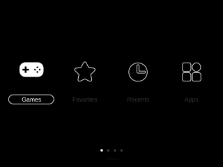

# muOS Theme Repository

Here you can download all the themes, made by members of the muOS community. 
- [Official muOS website](https://muos.dev/).
- Join the community [here](https://discord.gg/USS5ybVtDz).
- Check out the [Releases](https://github.com/MustardOS/theme/releases) page to download every theme as an archive.

Drop any of these .zip files into your device's ARCHIVE folder, using the on-device Archive Manager application to install them.

|   |   |   |
| :-----------------------------------------------------------: | :-----------------------------------------------------------: | :-----------------------------------------------------------: |
|  [Analogue-Arimo](https://github.com/MustardOS/theme/releases/download/2024-05-31_1018/Analogue-Arimo.zip) # [by: VagueParade] |  [Analogue-Arimo](https://github.com/MustardOS/theme/releases/download/2024-05-31_1018/Analogue-Arimo.zip) ## [by: VagueParade]  |  [Analogue-Arimo](https://github.com/MustardOS/theme/releases/download/2024-05-31_1018/Analogue-Arimo.zip) You know, like this?Or even, this. [by: VagueParade]  |
