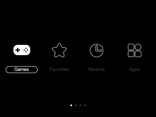

# muOS Theme Repository

Here you can download all the themes, made by members of the muOS community. 
- [Official muOS website](https://muos.dev/).
- Join the community [here](https://discord.gg/USS5ybVtDz).
- Check out the [Releases](https://github.com/MustardOS/theme/releases) page to download every theme as an archive.

Drop any of these .zip files into your device's ARCHIVE folder, using the on-device Archive Manager application to install them.

| :-----------------------------------------------------------: | :-----------------------------------------------------------: | :-----------------------------------------------------------: |
|  [Analogue-Arimo](https://github.com/MustardOS/theme/releases/download/2024-05-31_1018/Analogue-Arimo.zip)  by: Cheema OTB (original: Aemiii91) |  [Analogue](https://github.com/MustardOS/theme/releases/download/2024-05-31_1018/Analogue.zip)  by: Cheema OTB (original: Aemiii91)  |  [Art Book Next v1](https://github.com/MustardOS/theme/releases/download/2024-05-31_1018/Art.Book.Next.v1.zip)  by: ciskao (original: alphatoanant)  |
|  [Art Book Next v2](https://github.com/MustardOS/theme/releases/download/2024-05-31_1018/Art.Book.Next.v2.zip)  by: ciskao (original: alphatoanant) |  [Beanz](https://github.com/MustardOS/theme/releases/download/2024-05-31_1018/Beanz.zip)  by: VagueParade  |  [Blade](https://github.com/MustardOS/theme/releases/download/2024-05-31_1018/Blade.zip)  by: LMarcoMiranda  |
|  [C64](https://github.com/MustardOS/theme/releases/download/2024-05-31_1018/C64.zip)  by: antiKK |  [Candy](https://github.com/MustardOS/theme/releases/download/2024-05-31_1018/Candy.zip)  by: antiKK  |  [Catppuccin Frappe](https://github.com/MustardOS/theme/releases/download/2024-05-31_1018/Catppuccin.Frappe.zip)  by: jupyter & antiKK (original: Catppuccin)  |
|  [Cheers](https://github.com/MustardOS/theme/releases/download/2024-05-31_1018/Cheers.zip)  by: WhatPriceLJN |  [Custom2](https://github.com/MustardOS/theme/releases/download/2024-05-31_1018/Custom2.zip)  by: Vaidotas  |  [Cyberpunk Neon](https://github.com/MustardOS/theme/releases/download/2024-05-31_1018/Cyberpunk.Neon.zip)  by: antiKK  |
|  [DOTT](https://github.com/MustardOS/theme/releases/download/2024-05-31_1018/DOTT.zip)  by: antiKK |  [Def not SFC - Dark](https://github.com/MustardOS/theme/releases/download/2024-05-31_1018/Def.not.SFC.-.Dark.zip)  by: Skilo (original: danilocolasso)  |  [Def not SNES](https://github.com/MustardOS/theme/releases/download/2024-05-31_1018/Def.not.SNES.zip)  by: Skilo (original: danilocolasso)  |
|  [Disk Sys](https://github.com/MustardOS/theme/releases/download/2024-05-31_1018/Disk.Sys.zip)  by: Mr.DomoDude |  [Dracula](https://github.com/MustardOS/theme/releases/download/2024-05-31_1018/Dracula.zip)  by: antiKK  |  [Dreamcast Themecast](https://github.com/MustardOS/theme/releases/download/2024-05-31_1018/Dreamcast.Themecast.zip)  by: VagueParade  |
|  [EmulationStation](https://github.com/MustardOS/theme/releases/download/2024-05-31_1018/EmulationStation.zip)  by: jellydude72 |  [Fallout Caution](https://github.com/MustardOS/theme/releases/download/2024-05-31_1018/Fallout.Caution.zip)  by: antiKK  |  [Faux Dark](https://github.com/MustardOS/theme/releases/download/2024-05-31_1018/Faux.Dark.zip)  by: antiKK  |
|  [GB Dark](https://github.com/MustardOS/theme/releases/download/2024-05-31_1018/GB.Dark.zip)  by: Alukim |  [GB Light](https://github.com/MustardOS/theme/releases/download/2024-05-31_1018/GB.Light.zip)  by: Alukim  |  [GamePal - LCDLight](https://github.com/MustardOS/theme/releases/download/2024-05-31_1018/GamePal.-.LCDLight.zip)  by: vacarotti  |
|  [GamePal - LCDNight](https://github.com/MustardOS/theme/releases/download/2024-05-31_1018/GamePal.-.LCDNight.zip)  by: vacarotti |  [GamePal - Light](https://github.com/MustardOS/theme/releases/download/2024-05-31_1018/GamePal.-.Light.zip)  by: vacarotti  |  [GamePal - Night](https://github.com/MustardOS/theme/releases/download/2024-05-31_1018/GamePal.-.Night.zip)  by: vacarotti  |
|  [GamePal - SnesLight](https://github.com/MustardOS/theme/releases/download/2024-05-31_1018/GamePal.-.SnesLight.zip)  by: vacarotti |  [GamePal - SnesNight](https://github.com/MustardOS/theme/releases/download/2024-05-31_1018/GamePal.-.SnesNight.zip)  by: vacarotti  |  [GamePal - Sober](https://github.com/MustardOS/theme/releases/download/2024-05-31_1018/GamePal.-.Sober.zip)  by: vacarotti  |
|  [Analogue-Arimo](https://github.com/MustardOS/theme/releases/download/2024-05-31_1018/Analogue-Arimo.zip)  by: VagueParade |  [Analogue-Arimo](https://github.com/MustardOS/theme/releases/download/2024-05-31_1018/Analogue-Arimo.zip)  by: VagueParade  |  [Analogue-Arimo](https://github.com/MustardOS/theme/releases/download/2024-05-31_1018/Analogue-Arimo.zip)  by: VagueParade  |
|  [Analogue-Arimo](https://github.com/MustardOS/theme/releases/download/2024-05-31_1018/Analogue-Arimo.zip)  by: VagueParade |  [Analogue-Arimo](https://github.com/MustardOS/theme/releases/download/2024-05-31_1018/Analogue-Arimo.zip)  by: VagueParade  |  [Analogue-Arimo](https://github.com/MustardOS/theme/releases/download/2024-05-31_1018/Analogue-Arimo.zip)  by: VagueParade  |
|  [Analogue-Arimo](https://github.com/MustardOS/theme/releases/download/2024-05-31_1018/Analogue-Arimo.zip)  by: VagueParade |  [Analogue-Arimo](https://github.com/MustardOS/theme/releases/download/2024-05-31_1018/Analogue-Arimo.zip)  by: VagueParade  |  [Analogue-Arimo](https://github.com/MustardOS/theme/releases/download/2024-05-31_1018/Analogue-Arimo.zip)  by: VagueParade  |
|  [Analogue-Arimo](https://github.com/MustardOS/theme/releases/download/2024-05-31_1018/Analogue-Arimo.zip)  by: VagueParade |  [Analogue-Arimo](https://github.com/MustardOS/theme/releases/download/2024-05-31_1018/Analogue-Arimo.zip)  by: VagueParade  |  [Analogue-Arimo](https://github.com/MustardOS/theme/releases/download/2024-05-31_1018/Analogue-Arimo.zip)  by: VagueParade  |
|  [Analogue-Arimo](https://github.com/MustardOS/theme/releases/download/2024-05-31_1018/Analogue-Arimo.zip)  by: VagueParade |  [Analogue-Arimo](https://github.com/MustardOS/theme/releases/download/2024-05-31_1018/Analogue-Arimo.zip)  by: VagueParade  |  [Analogue-Arimo](https://github.com/MustardOS/theme/releases/download/2024-05-31_1018/Analogue-Arimo.zip)  by: VagueParade  |
|  [Analogue-Arimo](https://github.com/MustardOS/theme/releases/download/2024-05-31_1018/Analogue-Arimo.zip)  by: VagueParade |  [Analogue-Arimo](https://github.com/MustardOS/theme/releases/download/2024-05-31_1018/Analogue-Arimo.zip)  by: VagueParade  |  [Analogue-Arimo](https://github.com/MustardOS/theme/releases/download/2024-05-31_1018/Analogue-Arimo.zip)  by: VagueParade  |
|  [Analogue-Arimo](https://github.com/MustardOS/theme/releases/download/2024-05-31_1018/Analogue-Arimo.zip)  by: VagueParade |  [Analogue-Arimo](https://github.com/MustardOS/theme/releases/download/2024-05-31_1018/Analogue-Arimo.zip)  by: VagueParade  |  [Analogue-Arimo](https://github.com/MustardOS/theme/releases/download/2024-05-31_1018/Analogue-Arimo.zip)  by: VagueParade  |
|  [Analogue-Arimo](https://github.com/MustardOS/theme/releases/download/2024-05-31_1018/Analogue-Arimo.zip)  by: VagueParade |  [Analogue-Arimo](https://github.com/MustardOS/theme/releases/download/2024-05-31_1018/Analogue-Arimo.zip)  by: VagueParade  |  [Analogue-Arimo](https://github.com/MustardOS/theme/releases/download/2024-05-31_1018/Analogue-Arimo.zip)  by: VagueParade  |
|  [Analogue-Arimo](https://github.com/MustardOS/theme/releases/download/2024-05-31_1018/Analogue-Arimo.zip)  by: VagueParade |  [Analogue-Arimo](https://github.com/MustardOS/theme/releases/download/2024-05-31_1018/Analogue-Arimo.zip)  by: VagueParade  |  [Analogue-Arimo](https://github.com/MustardOS/theme/releases/download/2024-05-31_1018/Analogue-Arimo.zip)  by: VagueParade  |
|  [Analogue-Arimo](https://github.com/MustardOS/theme/releases/download/2024-05-31_1018/Analogue-Arimo.zip)  by: VagueParade |  [Analogue-Arimo](https://github.com/MustardOS/theme/releases/download/2024-05-31_1018/Analogue-Arimo.zip)  by: VagueParade  |  [Analogue-Arimo](https://github.com/MustardOS/theme/releases/download/2024-05-31_1018/Analogue-Arimo.zip)  by: VagueParade  |
|  [Analogue-Arimo](https://github.com/MustardOS/theme/releases/download/2024-05-31_1018/Analogue-Arimo.zip)  by: VagueParade |  [Analogue-Arimo](https://github.com/MustardOS/theme/releases/download/2024-05-31_1018/Analogue-Arimo.zip)  by: VagueParade  |  [Analogue-Arimo](https://github.com/MustardOS/theme/releases/download/2024-05-31_1018/Analogue-Arimo.zip)  by: VagueParade  |

|   |   |   |
| :-----------------------------------------------------------: | :-----------------------------------------------------------: | :-----------------------------------------------------------: |
|   |   |   |
